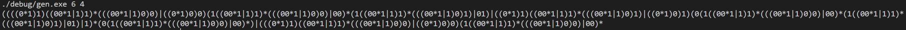
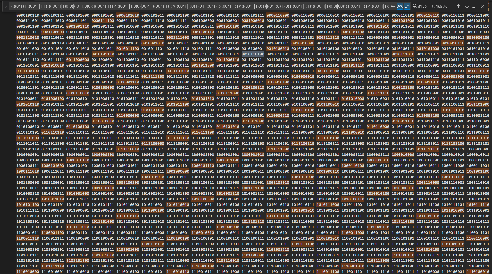

# DIVISIBLE REGEX GENERATOR

---

对于正整数 $N$ 和 $M$, 生成可匹配被 $N$ 整除后余 $M$ 的数字的二进制表示的正则表达式.

## 编译

```sh
make
```

## 运行

```sh
make run RUNARGS="[N] [M]"
```

或

```sh
./debug/gen.exe [N] [M]
```

## 效果演示

下面展示被 6 除余 4 的情况:




