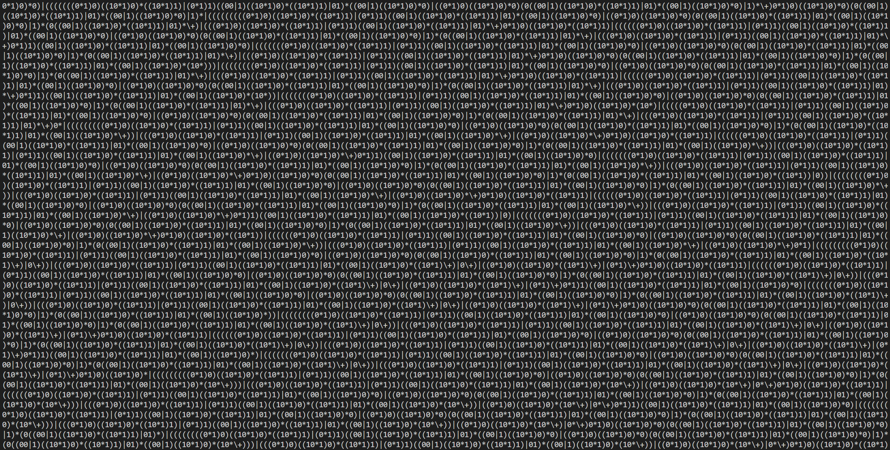
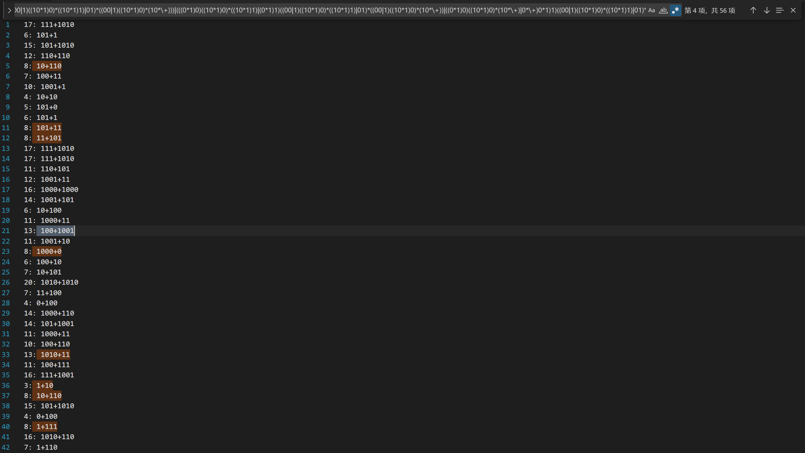

# DIVISIBLE REGEX GENERATOR

---

对于正整数 $N$, 生成可匹配可被 $N$ 整除的数字的二进制表示的正则表达式.

## 编译

```sh
make
```

## 运行

```sh
make run RUNARGS=[N]
```

或

```sh
./debug/gen.exe [N]
```

## 效果演示

下面展示可被 6 整除的情况:




